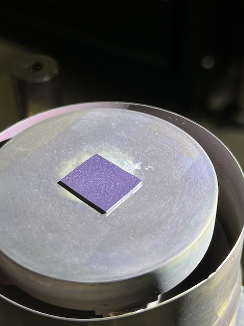
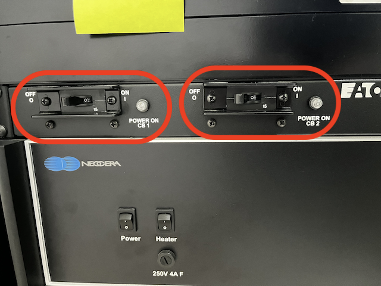

# Instruments

Documentation and manuals for the available instruments used in Qudev experimental research.

## Pulsed Laser Deposition (Basic)
:information_source:[1.1.0](../changelog/index.md) 

Symbol: 
⚠️ = Warning/Cautious! 
🔥 = Cautious for burning risk/hot surface

### Introduction

Pulsed laser deposition (PLD) is essentially a physical vapor deposition (PVD) method used to create thin films, where a high-powered pulsed laser beam is focused into a vacuum chamber to hit the surface of the solid target material intended for deposition. Adjacent to the target lies the substrate, where the thin film grows.

This documentation covers the basic operation of PLD. For advanced operations such as target mounting, deposition under Ar/N₂ gas, the detail on editing the PLD routine, etc. see the advanced section (under construction).

### Substrate Mounting
1. Before mounting, ensure the substrate heater stage is clean by removing any leftover silver paste using sandpaper and a cleaning tissue.
> :warning: Before mounting, clean the substrate using the method explained in the [**Recipes**](../recipes/substrate_cleaning.md) section, or perform substrate preparation according to your own experimental requirements. :warning:
2. Apply silver paste to the stage (enough to cover the substrate backside surface) and place the substrate onto the sample stage.
3. Turn ON the Main Power of the system (1st from top): Turn ON the **CB(Circuit Breaker)2** and **CB1**.
4. Connect the **thermometer** and **heater** cable.
5. Turn ON the Heater Controller Box (2nd from top): Turn ON **Power**, and **Heater** button.
6. Turn ON the Motor Controller Box (3rd from top): Turn ON **Power**.
7. Turn ON the PC. Enter the password.

8. Open the Neocera N-PLD software:
    - Go to **Manual Control** > **Heaters**.
    - Set the **Setpoint** to 100°C and the **Ramp Rate** to 20°C per minute. :fire:
    - Click **Start**.
9. Wait for the curing to finish, approx. 5 minutes. 
    - Push the **Reset Controller** button to turn off the heater.

  
*Figure 1. Substrate mounted on the holder/heater*

  
*Figure 2. Circuit breaker switch*

  
*Figure 3. Heater and Motor controller box*

### Initialize the Motors
- On the Neocera N-PLD software:
    - Go to **Start** > **Control Panel** > **System Initialization and Motor Homing** tab > **Home all motors**
> The carousel target motor (**X**) will rotate to locate the home position, and the rotation motor (**Y**) will initialize the target rotation. The PLD routine can only be executed if the homing process is completed successfully without any failures.
    - Upon a successful homing process, the LED indicators for motors X and Y will light up both on the controller box and in the software.

### Inserting the Substrate Stage
1. Make sure the silver paste is cured and substrate is securely attached to the heater stage.
2. Make sure the stage is cool enough. :warning: :fire:
3. **Take off** the thermometer and heater cable. :warning:
4. The substrate stage is connected to an 8" CF flange.
> Prepare your hand and body position beforehand so that you can smoothly insert the flange into the chamber port.:warning:**HEAVY**:warning:
5. Align the flange with the vacuum chamber. Ensure that the flange is properly seated and that there are no obstructions.
6. Hand-tighten the screws into the flange, ensuring they are inserted in the **marked** position.
7. Using **torque wrench**, begin tightening the screws in a **crisscross** or **star pattern** to ensure even distribution of pressure.
> This helps prevent warping or uneven sealing of the flange.
8. Use the torque wrench to apply the specified torque value. Turn the wrench until you hear or feel the **click**, indicating that the desired torque has been reached.
9. Repeat this process for all screws, following the same pattern.

### Starting the PLD Chamber Evacuation Routine
1. Open the turbo molecular pump **(TMP) valve** fully (**counter-clockwise**).
2. Load the routine on the software to start pumping:
    - Go to **Start** > **Control Panel** > **PLD Execution** tab > select **Load Routine**
    - Go to **New Routine** directory > **TMP** folder > choose **Pumping 1e-7 PLD** file > **OK**.
    - Press **Start Routine** button.
    - Rough pump will start and subsequently the TMP will start spinning-up to the maximum frequency of **1kHz**.
3. Wait until the pressure reaches **10-5 Torr** or less.
   > :warning: If the pressure does not reach **10-3 Torr** within a few minutes, check all possible sources of leaks (e.g., unfastened coarse or vent valves, untightened window ports, etc.)

### Substrate Thermal Cleaning and Degassing
1. Connect the thermometer and heater cable.
2. Open the Neocera N-PLD software:
    - Go to **Manual Control** > **Heaters**.
    - Set the **Setpoint** to your desired degassing temperature (e.g., 350°C or 700°C) and the **Ramp Rate** to 20°C per minute. :fire:
    > The substrate stage maximum heating temperature is around 900°C.
    - Click **Start**.
3. Wait for at least 1 hour.
4. Push the **Reset Controller** button to turn off the heater or proceed to ramp the temperature (deposition with substrate heating).

### Setting the Deposition Temperature
1. If you plan to perform the deposition at a spesific temperature, you can start to ramping the substrate temperature up/down.
2. You can ramp-up/down the temperature by setting the heater controller in the software: **Manual Control** > **Heaters**
> See the [silver paste curing step](#silver-paste-curing) / [thermal cleaning step](#Substrate-Thermal-Cleaning-and-Degassing).

### Deposition Process
1. Turn ON the **Laser’s KEY** and wait for at least 5 minutes. Take note the number appear on the LED.
> Wait the water coolant to circulate.
>
> The numbers indicate the number of the flashlamp discharge counts (millions > thousands > hundreds).
2. Turn ON the **Laser Trigger Box**.
3. Click **Start/Stop** button on the laser machine and wait for 5 minutes.
4. Click the **Shutter** button on the laser machine and check the flash lamp.
5. Adjust the **deposition shutter** (inside the chamber) by rotating the knob:
    - Ensure the substrate remains covered, but the deposition shutter does not shadow the target.
    - Open the deposition shutter by **2°** from the original **60°** closed position by rotating the knob clockwise.

#### Pre-deposition target cleaning
1. **Abort** the TMP routine to load the pre-deposition target cleaning routine.
> TMP will continue pumping even after the routine was aborted
2. **Load routine** for pre-deposition target cleaning. Start the routine.
> It is usually set for 3 minutes
> See the detail of PLD Routine in the advanced section (under construction).
3. Target carousel motor will move to the designated target position.
4. :eight_spoked_asterisk: *Laser* will start firing. Use the **laser safety goggle!** :warning:
> Target's surface will be ablated by laser (cleaned).

#### Deposition
1. :warning: **OPEN** the deposition shutter fully to the **150°** marked position by rotating the knob clockwise. :warning:
2. **Load routine** for deposition. Start the routine.
3. :eight_spoked_asterisk: *Laser* will start firing. Use the **laser safety goggle!** :warning:

### Finishing the Deposition
1. Move the **deposition shutter** back to the **closed** position (**60°**).
2. Turn **OFF** the laser:
    - Go to the laser controller > **Shutter** button OFF > **Start/Stop** button OFF > **Trigger Box** button OFF > wait for 5 minutes > **Laser Key**.
3. **Heater** options after deposition (if used):
    1. Turn **OFF** the heater, let the substrate temperature cool down naturally:
        - Go to **Manual Control** > **Heaters** > **Reset controller**
    2. Ramp **down** or **up**(e.g. for post-deposition annealing) the heater in a controlled manner:
        - Go to **Manual Control** > **Heaters** > **Setpoint** at your desired **Ramp Rate**
        > See the [**Substrate Thermal Cleaning and Degassing**](#Substrate-Thermal-Cleaning-and-Degassing) section.

#### Stop the TMP
1. **OPEN** the N₂ gas cylinder.
2. **CLOSE** the TMP gate valve (clockwise) until you hear click sound.
3. **Load routine** for TMP > **TMP ramp down to 200Hz and STOP**
> TMP will ramp down to 200 Hz and then stopped.

#### Taking out the substrate stage
1. **OPEN** the **N₂ coarse** valve.
2. **OPEN** the **N₂ vent** valve slowly to fill the chamber with N₂ gas.
3. **CLOSE** the N₂ vent and coarse valve after the chamber pressure equal to atm.
4. Using **torque wrench**, begin loosening the screws of the flange in a **crisscross** or **star pattern**(recommended).
5. Make sure the deposition shutter is in the closed position (**60°**). :warning:
6. Remove the CF flange slowly, maintaining its horizontal position during removal to avoid collision with the chamber wall. :warning:**HEAVY**:warning:
7. Put the substrate stage on the styrofoam holder facing the substrate UP.

#### Closing the chamber port and put the chamber in vacuumed condition
1. Put the plain CF flange to the chamber port replacing the substrate stage and screw the flange tight
2. Open the main chamber valve.
3. Vacuum the chamber again down to ~**10-5 Torr**. > See the [Starting the PLD Chamber Evacuation Routine](#Starting-the-PLD-Chamber-Evacuation-Routine) section. 
4. Close the main chamber valve.
5. Stop the TMP. > See the [Stop the TMP](#Stop-the-TMP) section.

#### Shutting down the PLD machine
1. Turn **OFF** the motor controller.
2. Turn **OFF** the heater controller (**Heater** and **Power** button).
3. Shutdown the PC.
4. Turn **OFF** the Main Power of the system **CB2** and **CB1**.
5. **CLOSE** the N₂ (and any other gas used during deposition) cylinder.

&nbsp;

>Draft by E.D.I
>
>Edited by G.G.R

