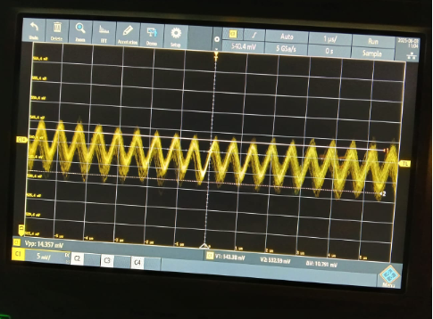
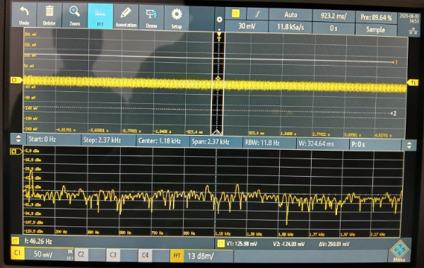
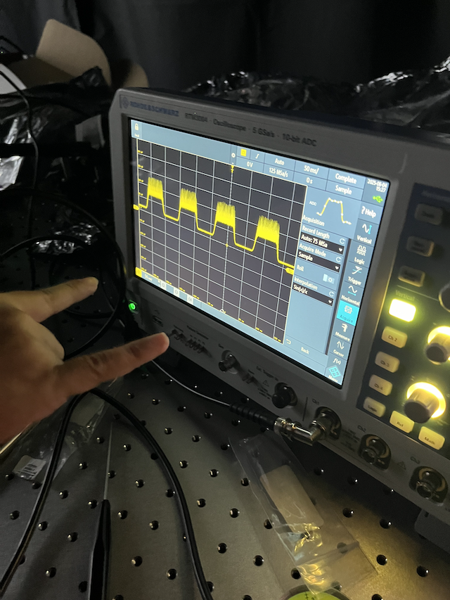
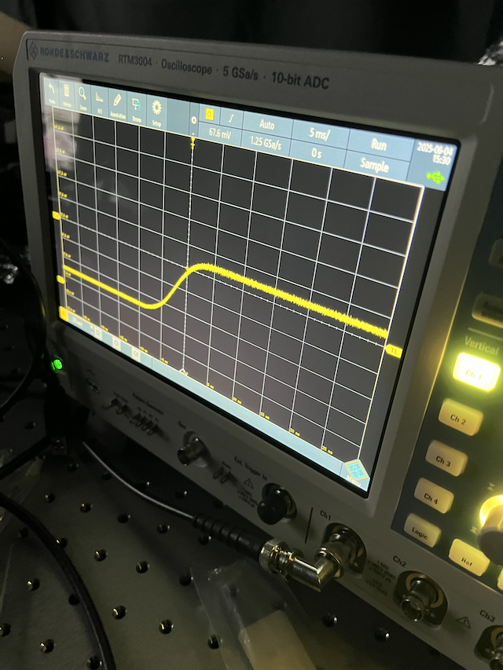

# Quantum Optics Laboratory

Documentation of miscellaneous know-how and troubleshooting in Quantum Optics Lab.

## Troubleshootings
:information_source:[1.2.0](../changelog/index.md) 

Symbol: 
⚠️ = Warning/Cautious! 
🔥 = Cautious for burning risk / hot surface

### Power Cable Extension

Do not use a long extension cable to power an equipment otherwise you will get spurious signals like the one shown in Fig. 1. The extension cable can act as an antenna and may pick up unwanted signals along the way.

 
*Figure 1. ~ 1 MHz spurious signal from a Si Photodetector.*

### Power Line Frequency Noise

50 Hz noise from the power line is still creeping in as displayed in Fig. 2, and needs an iso-transformer to tame the noise. Luckily, no 100, 150 Hz harmonics were detected.

 
*Figure 2. Noise spectrum from open probe oscilloscope.*

### Warm-up on Si Photodetector

The trans-impendance amplifier hook-up on the Si photodetector needs some time to warm-up. If you got a spurious signal on the oscilloscope, do not worry, give a minute or two and the signal will be gone.

 
*Figure 3. Before warm-up.*

 
*Figure 4. After warm-up.*
